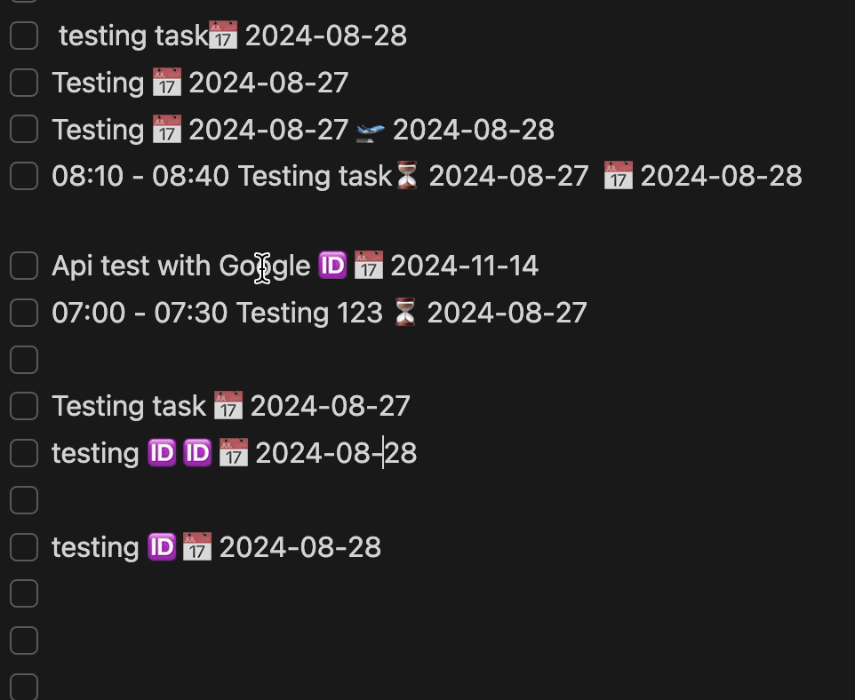

# Obsidian Date Picker

This is a simple and easy to use date picker designed to be used with the tasks plugin for Obsidian.
Simply just click on the emojis and it'll pop up. New features would be added in the future to be used as a date picker everywhere.

This date picker utilizes the amazing Vanilla JS Datepicker underneath with custom styling.

### Credits

Shoutout to the developers of [VanillaJS Datepicker](https://github.com/mymth/vanillajs-datepicker)
